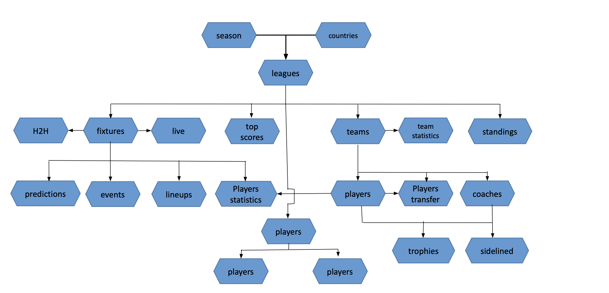
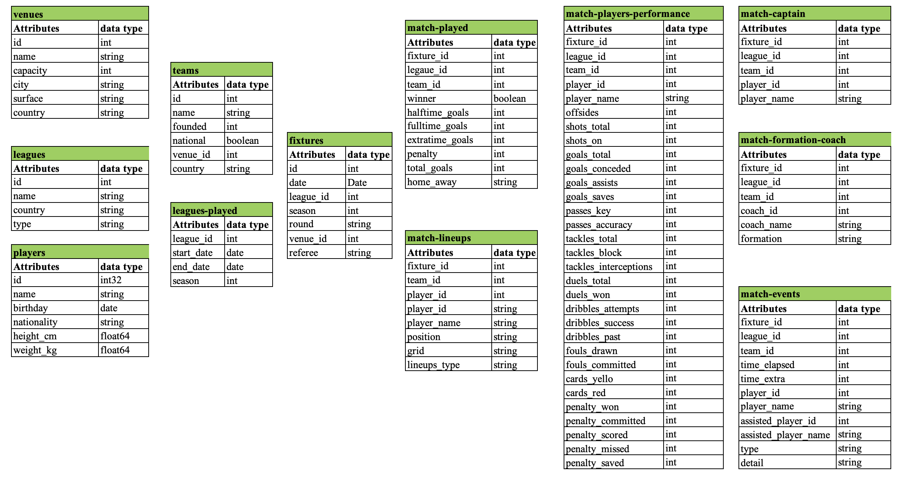
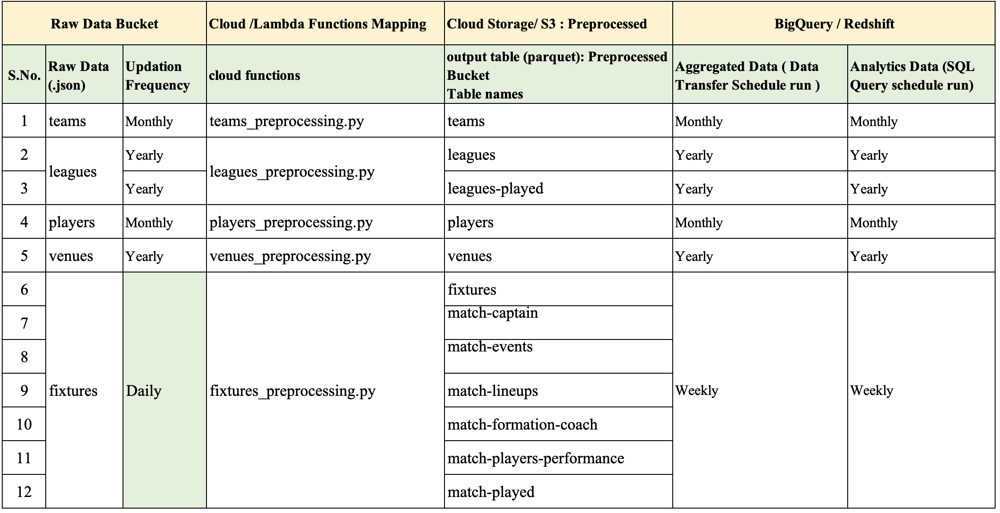
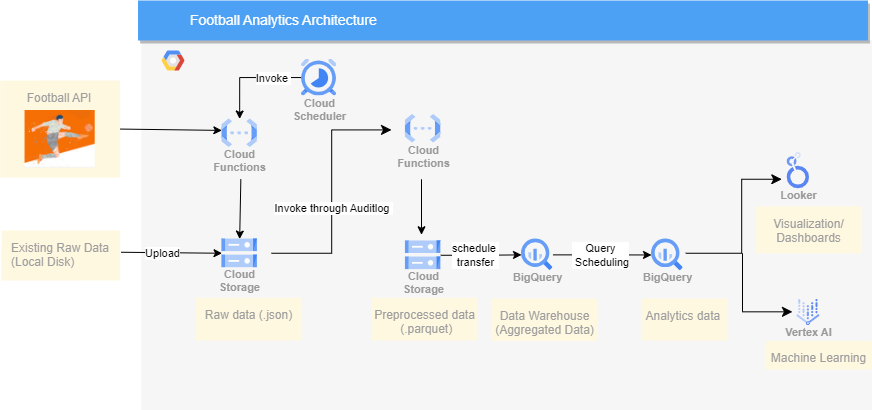
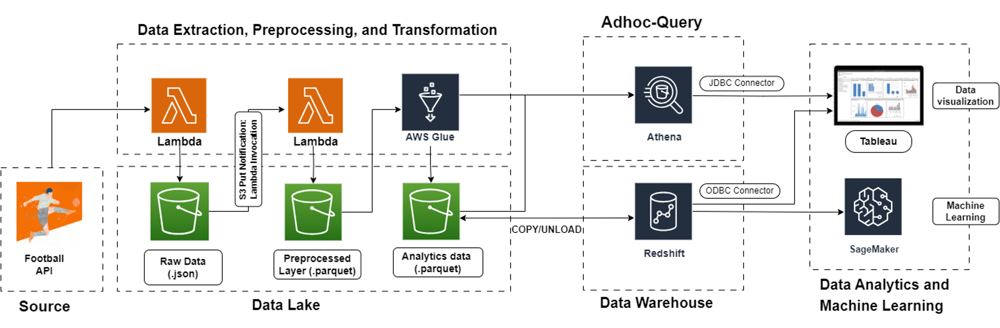
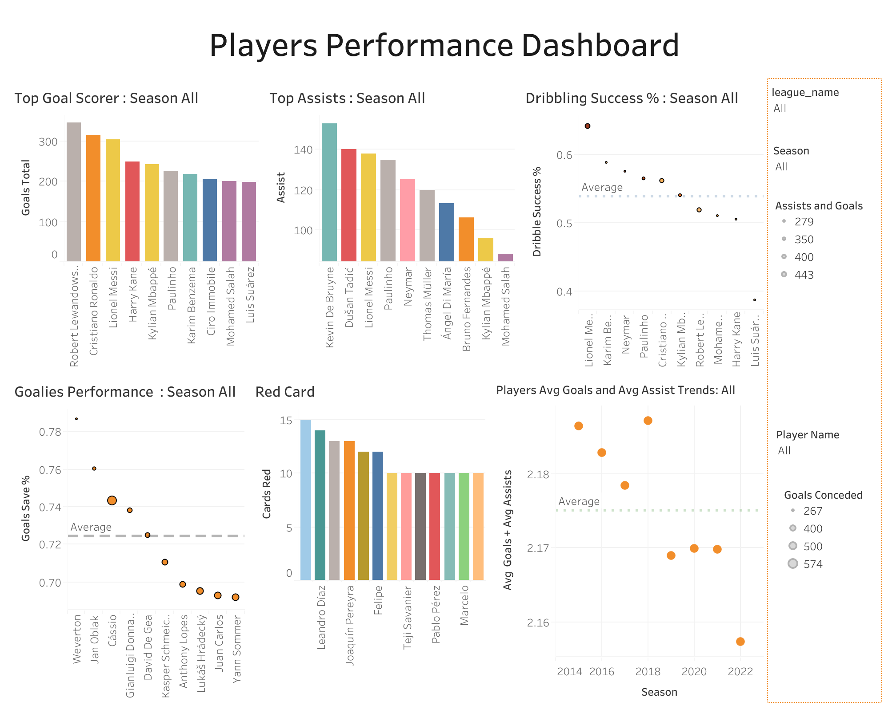

# Football-League-Analytics ( AWS and GCP Implementation)

## Objective: 
To develop a robust data pipeline that automatically collect, store, and preprocess the 950+ football leagues data, facilitating advanced analysis and predictive modeling.

## Stages: 
* Data Collection 
* Data Modeling 
* Data Preprocessing 
* Data Updation Policy and Functions Mapping
* Data Storage and Warehousing
* Cloud Service Selection and Architecture Finalization 
* Data Visualization and Predictive Modeling 

## Data Collection: 
### Football API Architecture: 

* Batch Data Collection: 

## Data Modeling: 

## Data Preprocessing: 

## Data Updation Policy and Functions Mapping: 

## Data Storage and Warehousing: 

## Cloud Service Selection and Architecture Finalization: 
#### Cloud Service Selection Criterion:
* Serverless Architecture
* Easy to Automate 
* Less Overhead 
* Real-time processing of data 
* Easy to integrate with Third party softwares

#### GCP Architecture:  

#### AWS Architecture: 

1. Compute: Cloud Function  
     - Serverless Architecture 
     - Extracting Fixtures data automatically from Football API (Rapid API)
     - Cloud Schedular Invoke the cloud functions for fixtures extraction. 
     - Preprocessing all the incoming raw data file (.json) and convert into tabular data (.parquet) and write into respective preprocessed cloud storage bucket.
     - Preprocessing cloud functions triggered when any new data arrived in raw data bucket ( Trigger signal sent using"Auditlog") 
2. Storage: Cloud Storage
     - Preferred option for storing unstructured data 
     - Staging the Raw Data and Preprocessed data 
3. Data Warehousing: BigQuery 
     - Easy to run SQL query 
     - Store the Aggregated data 
4. Visualization: Looker and Tableau
5. Machine Learning: Vertex AI 

## Data Visualization and Predictive Modeling 

#### Live Dashboard Link: 
Looker Dashboard: [Click Here](https://lookerstudio.google.com/embed/reporting/d627f950-b2f4-4faa-ba21-eebc5abf59e7/page/tEnnC)

Tableau Dashboard: [Click Here](https://public.tableau.com/views/PlayersPerformancesDashboard/PlayersPerformances?:language=en-US&publish=yes&:display_count=n&:origin=viz_share_link)

