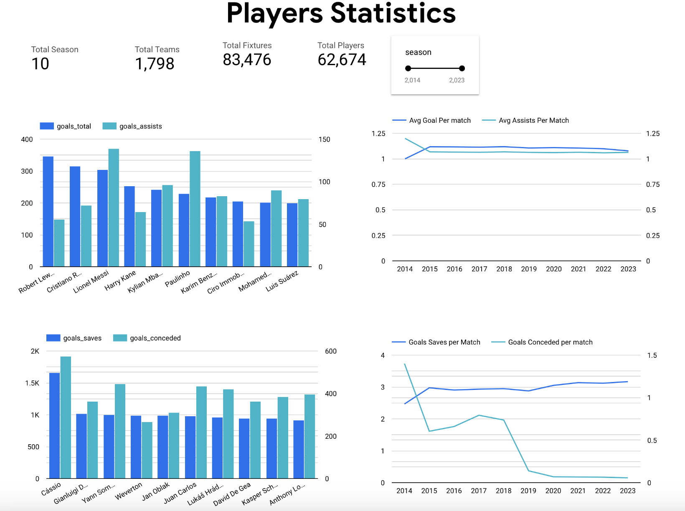

# Football-League-Analytics ( AWS and GCP Implementation)
* Note: This project is deployed independently on AWS and GCP.
## Objective: 
To develop a robust data pipeline that automatically collect, store, and preprocess the 950+ football leagues data, facilitating advanced analysis and predictive modeling.

## Stages: 
* Data Collection 
* Cloud Service Selection and Architecture Finalization 
* Data Modeling 
* Data Preprocessing 
* Data Updation Policy and Functions Mapping
* Data Storage and Warehousing
* Data Visualization and Predictive Modeling 

## Data Collection: 
### Football API Architecture: 

* To run the python Script- GCP: Cloud Functions, AWS: Lambda Functions
* Initially all the raw data from 2008-2022 is collected in local system using python script. 
* Only fixtures data is changing frequently (Approx. 600+ matches played per day). 
* Extracting Fixtures data automatically using serverless cloud or lambda function from [Football API (RAPID API)](https://rapidapi.com/api-sports/api/api-football) staged in raw data bucket. 
* In GCP: Cloud Schedular Invoke the cloud functions for fixtures extraction. 

## Cloud Service Selection and Architecture Finalization: 
#### Cloud Service Selection Criterion:
* Serverless Architecture
* Easy to Automate and Ease of Scheduling 
* Less Overhead 
* Real-time data processing 
* Easy to integrate with third party visualization and machine learning tools. 

#### GCP Architecture:  

#### AWS Architecture: 

## Data Modeling: 
#### Schema

## Data Preprocessing: 
* Preprocessing all the incoming raw data file (.json) and convert into tabular data (.parquet) and write into respective preprocessed cloud storage or S3 bucket. 
* Preprocessing cloud functions triggered when any new data arrived in raw data bucket.
* Auditlog trigger: GCP preprocessing cloud functions is triggered new file is added to raw data bucket. 
* S3 Put Notification trigger: AWS preprocessing lambda function is triggered when new file is added to S3 raw data bucket. 

## Data Updation Policy and Functions Mapping: 

## Data Storage and Warehousing: 
#### Storage (Object Storage)
*  GCP: Cloud Storage 
*  AWS: S3 
* Preferred option for storing unstructured data and support all kind file format
* Staging the Raw Data and Preprocessed data 
#### Data Warehousing- GCP:  BigQuery , AWS: Redshift 
* Robust SQL querying capabilities , Ease of data transfer and integration
* Schedule transfer of data from preprocessed bucket to BigQuery or Redshift 
* Running the SQL query as per requirement to get the analytics data. 
* Ease to connect the third party visualization tools such as Tableau. 

#### For AWS Only 
* Glue Service: For Data Cataloging and ETL processes
* Athena: Leveraging the AWS Glue Data Catalog, Athena enables to query data from various sources seamlessly. Used for Adhoc querying.

## Data Visualization and Predictive Modeling 
#### Visualization: 
* Tools: Looker, Tableau
* Looker is directly conencted with BigQuery. 
* Tableau is connected to BigQuery directly through google account authentication. 
* Tableau is connected to Redshift or Athena  through JDBC or ODBC Driver to access the data. 
#### Predictive Modeling (Machine Learning):
*  GCP: Vertex AI 
*  AWS: SageMaker 
*  Directly connect with data warehouse to get the upated data and to do the predictive modeling, and deploying the machine learning model at scale. 

#### Live Dashboard Link: 

Tableau Dashboard: [Click Here](https://public.tableau.com/app/profile/faiyaz.ahmad/viz/PlayersPerformancesDashboard/Dashboard1)

Looker Dashboard: [Click Here](https://lookerstudio.google.com/embed/reporting/d627f950-b2f4-4faa-ba21-eebc5abf59e7/page/tEnnC)

